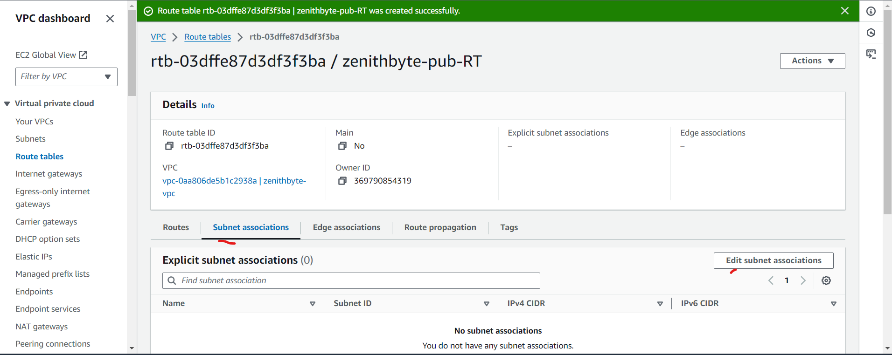

# AWS-projects

## AWS CLOUD SOLUTION FOR 2 COMPANY WEBSITES USING A REVERSE PROXY TECHNOLOGY

We are designing a secure infrastructure within an AWS Virtual Private Cloud (VPC) for `Zenithbyte`  Company, which runs a WordPress CMS for its primary business website and a [Tooling](https://github.com/ogechukwu1/Devops-Tooling-Website-Solution) website for the DevOps team. 

To enhance security and performance, the company has chosen to implement NGINX reverse proxy technology as part of the solution.

The key requirements for this project are to reduce costs, enhance security, and improve scalability.  Therefore, when implementing the architecture outlined below, ensure that the infrastructure for both the WordPress and Tooling websites is resilient to web server failures, capable of handling increased traffic, and remains cost-effective. 

__AWS Resources Required for the Design:__

- __Region:__ North Virginia (us-east-1)

- __Availability Zones:__ 3 subnets in us-east-1a, and 3 subnets in us-east-1b

- __VPC Network Range:__ 10.0.0.0/16

- __Subnets:__ 10.0.1.0/24, 10.0.2.0/24, 10.0.3.0/24, 10.0.4.0/24, 10.0.5.0/24, 10.0.6.0/24

   - 6 subnets total: 4 private subnets and 2 public subnets

- __Internet Gateway__

- __2 NGINX Servers__ for reverse proxy

- __2 Bastion Hosts/Jump Servers__

- __2 Application Load Balancers (ALB)__

- __Auto Scaling Groups__ to manage scaling of EC2 instances

- __2 NAT Gateways__ to allow resources in private subnets to communicate with the internet via the Internet Gateway.

__Note:__ The NAT gateway only permits traffic to the internet and does not allow incoming traffic from the internet.

- Route DNS

- RDS for database management

- Amazon Elastic File System (EFS) for file management

__AWS MULTIPLE WEBSITE PROJECT__

__Initial setup__

- Create a dedicated sub-account in AWS to manage all resources for the company's AWS solutions, and assign an appropriate name, such as `DevOps`.

- From the root account, create an Organizational Unit (OU) `Dev` and move the sub-account into the OU. The `Dev` resources will be launched within this sub-account.

- Create a domain name for the company website using a domain name provider, where you can acquire a domain name through the [Namecheap](https://www.namecheap.com/) website.

- After that, set up a hosted zone in AWS and link the name servers from the hosted zone to the domain name.

__SET UP A VIRTUAL PRIVATE CLOUD ON AWS (VPC):__

- CREATE VPC

- Create the subnets as outlined in the architecture, with 3 subnets in each Availability Zone. For us-east-1a, the subnets should be as follows:
  - Public Subnet: 10.0.1.0/24
  - Private Subnet 1: 10.0.3.0/24
  - Private Subnet 2: 10.0.5.0/24

- Additionally, create 3 subnets in the Availability Zone us-east-1b with the following CIDR blocks:
  - Public Subnet: 10.0.2.0/24
  - Private Subnet 1: 10.0.4.0/24
  - Private Subnet 2: 10.0.6.0/24

__N/B;__ At this stage, these subnets are neither designated as private nor public. Their classification as private or public will depend on the Internet Gateway and NAT Gateway associated with them.

- Next, create a __route table__ and associate it with the public subnets.

- Associate the Route Table with Public Subnets:
  - Click on the Subnet associations tab within the route table details.
  - Click Edit subnet associations.
  - Select the public subnets (e.g, 10.0.1.0/24 in us-east-1a and 10.0.2.0/24 in us-east-1b).
  - Click Save associations.

Create a __route table__ and associate it with the private subnets.

Create an __Internet Gateway__ for the public subnets.

Attach the Internet Gateway to Your VPC:

Edit the route in the public route table and associate it with the Internet Gateway. This configuration will enable the public subnets to be accessible from the Internet.

Create 3 Elastic IPs: one Elastic IP will be assigned to the NAT Gateway, while the other two will be allocated to the Bastion hosts.

