# AWS-projects

## AWS CLOUD SOLUTION FOR 2 COMPANY WEBSITES USING A REVERSE PROXY TECHNOLOGY


We are designing a secure infrastructure within an AWS Virtual Private Cloud (VPC) for `Zenithbyte`  Company, which runs a WordPress CMS for its primary business website and a [Tooling](https://github.com/ogechukwu1/Devops-Tooling-Website-Solution) website for the DevOps team. 

To enhance security and performance, the company has chosen to implement NGINX reverse proxy technology as part of the solution.

The key requirements for this project are to reduce costs, enhance security, and improve scalability.  Therefore, when implementing the architecture outlined below, ensure that the infrastructure for both the WordPress and Tooling websites is resilient to web server failures, capable of handling increased traffic, and remains cost-effective. 


__AWS Resources Required for the Design:__

- __Region:__ North Virginia (us-east-1)

- __Availability Zones:__ 3 subnets in us-east-1a, and 3 subnets in us-east-1b

- __VPC Network Range:__ 10.0.0.0/16

- __Subnets:__ 10.0.1.0/24, 10.0.2.0/24, 10.0.3.0/24, 10.0.4.0/24, 10.0.5.0/24, 10.0.6.0/24

   - 6 subnets total: 4 private subnets and 2 public subnets

- __Internet Gateway__

- __2 NGINX Servers__ for reverse proxy

- __2 Bastion Hosts/Jump Servers__

- __2 Application Load Balancers (ALB)__

- __Auto Scaling Groups__ to manage scaling of EC2 instances

- __2 NAT Gateways__ to allow resources in private subnets to communicate with the internet via the Internet Gateway.


__Note:__ The NAT gateway only permits traffic to the internet and does not allow incoming traffic from the internet.

- Route DNS

- RDS for database management

- Amazon Elastic File System (EFS) for file management


__AWS MULTIPLE WEBSITE PROJECT__


__Initial setup__

- Create a dedicated sub-account in AWS to manage all resources for the company's AWS solutions, and assign an appropriate name, such as `DevOps`.

- From the root account, create an Organizational Unit (OU) `Dev` and move the sub-account into the OU. The `Dev` resources will be launched within this sub-account.


- Create a domain name for the company website using a domain name provider, where you can acquire a domain name through the [Namecheap](https://www.namecheap.com/) website.

- After that, set up a hosted zone in AWS and link the name servers from the hosted zone to the domain name.


__SET UP A VIRTUAL PRIVATE CLOUD ON AWS (VPC):__

- CREATE VPC


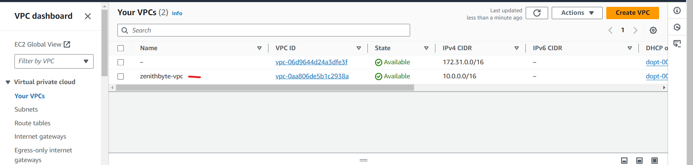


- Create the subnets as outlined in the architecture, with 3 subnets in each Availability Zone. For us-east-1a, the subnets should be as follows:
  - Public Subnet: 10.0.1.0/24
  - Private Subnet 1: 10.0.3.0/24
  - Private Subnet 2: 10.0.5.0/24


- Additionally, create 3 subnets in the Availability Zone us-east-1b with the following CIDR blocks:
  - Public Subnet: 10.0.2.0/24
  - Private Subnet 1: 10.0.4.0/24
  - Private Subnet 2: 10.0.6.0/24


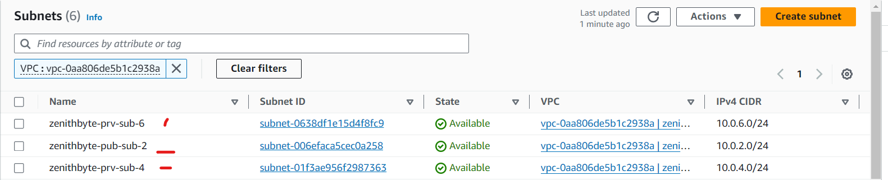


__N/B;__ At this stage, these subnets are neither designated as private nor public. Their classification as private or public will depend on the Internet Gateway and NAT Gateway associated with them.

- Next, create a __route table__ and associate it with the public subnets.


- Associate the Route Table with Public Subnets:
  - Click on the Subnet associations tab within the route table details.
  - Click Edit subnet associations.
  - Select the public subnets (e.g, 10.0.1.0/24 in us-east-1a and 10.0.2.0/24 in us-east-1b).
  - Click Save associations.


Create a __route table__ and associate it with the private subnets.


Create an __Internet Gateway__ for the public subnets.


Attach the Internet Gateway to Your VPC:


Edit the route in the public route table and associate it with the Internet Gateway. This configuration will enable the public subnets to be accessible from the Internet.


__Create 3 Elastic IPs:__ one Elastic IP will be assigned to the NAT Gateway, while the other two will be allocated to the Bastion hosts.


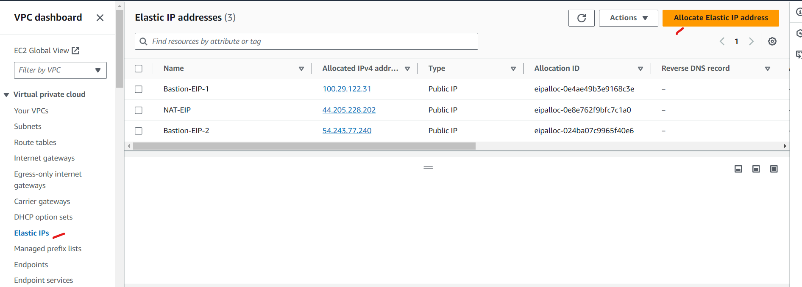


Create a NAT Gateway and assign one of the Elastic IPs. Ensure the NAT Gateway is created in the public subnet. A NAT Gateway allows instances in a private subnet to access services outside your VPC, while preventing external services from initiating connections to those instances.

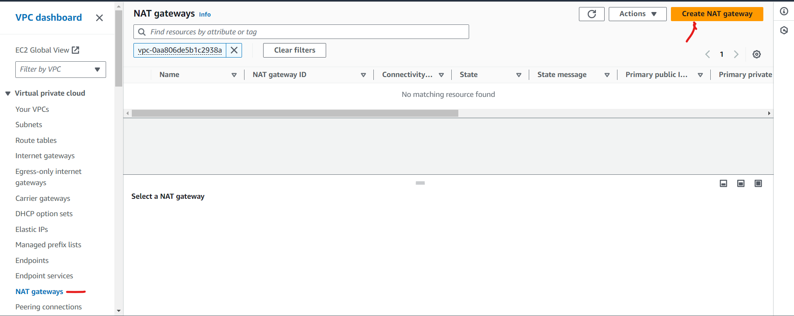


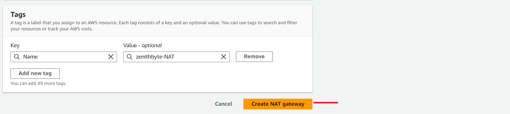


Modify the route in the private route table to associate it with the NAT Gateway. This enables outbound traffic to the internet while preventing inbound traffic from the internet.


__Create Security Group for NGINX Servers:__ Access to Nginx should be allowed only from the Application Load Balancer (ALB).


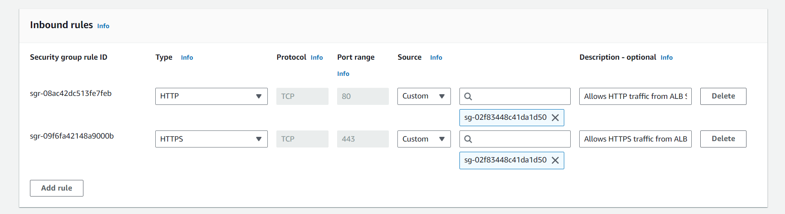


__Create Security Group for Bastion Servers:__ Access to Bastion servers should be allowed only from specific workstations for SSH access.

Therefore, you can use the public IP address of your workstation. 


- To find your public IP address using the Command Prompt (CMD) on your local workstation, you should use the following method:

  - Open Command Prompt:
  - Press Windows + R to open the Run dialog.
  - Type cmd and press Enter.
  - Run the Command `curl www.canhazip.com` to find your Public IP
  - If you specifically want to see your local (private) IP address on your network, you can use the `ipconfig` command:


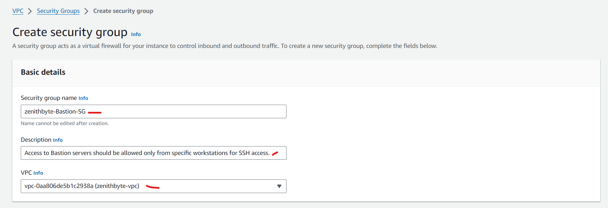


__Create Security Group for Application Load Balancer (ALB):__ Application Load Balancer (ALB) access should be allowed from the Internet.


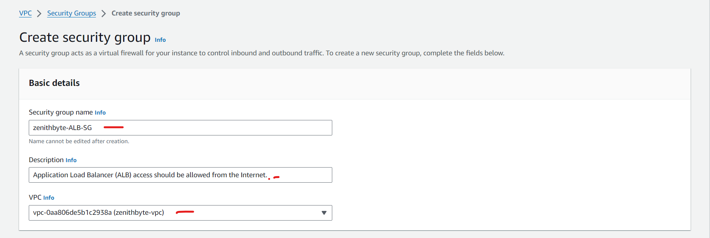


__Create Security Group for Web Servers:__ Access to Web Servers should only be allowed from NGINX servers and bastion host


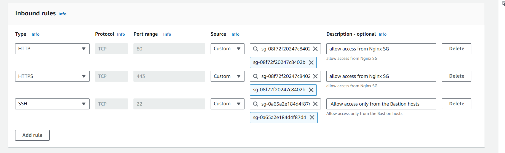


__Create Security Group for Data Layer (RDS and EFS):__ Access to RDS and EFS should be allowed only from Web Servers (for RDS) and from NGINX and Web Servers (for EFS)


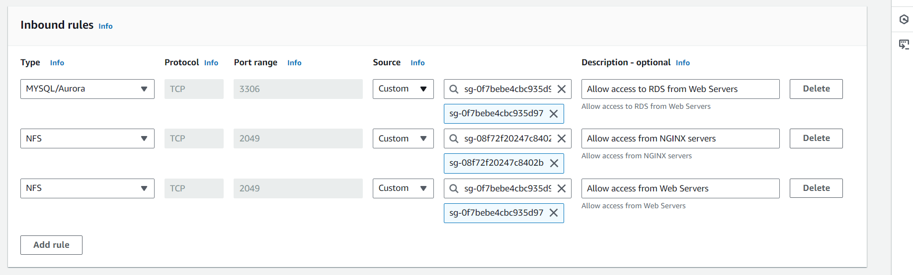


__Purchase a domain name and Create an ACM certificate__


__Create DNS records for both the `Tooling` and `WordPress` sites.__


Configure Elastic File System (EFS)


We will configure the mount target to enable access to the web servers in Subnet 3 (10.0.3.0/24) and Subnet 4 (10.0.4.0/24).

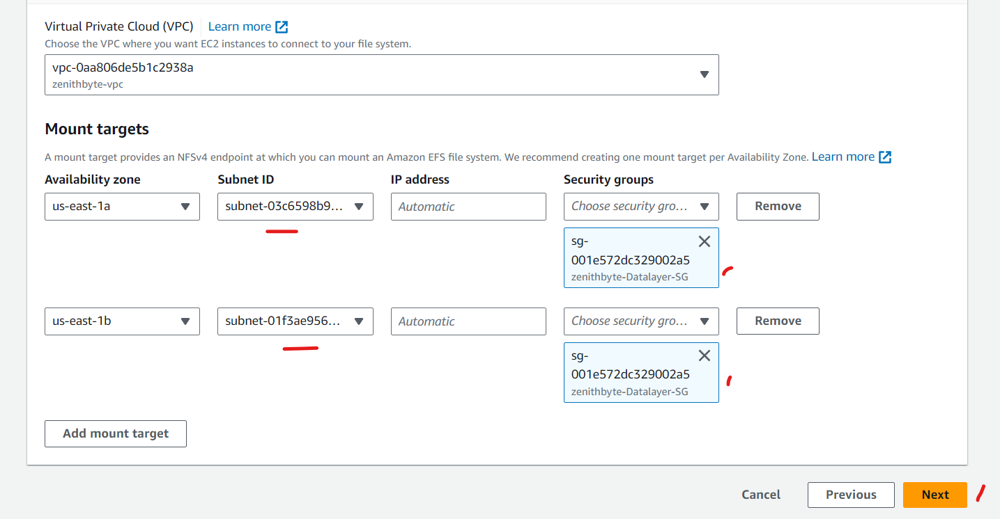


we will create separate access points for the Elastic File System (EFS). One access point will be dedicated to the Tooling website, while the other will be for the WordPress website.


Configure Amazon Relational Database Service (RDS)

To configure the RDS, we need to create a KMS key using the Key Management Service (KMS) for encrypting the database instance.


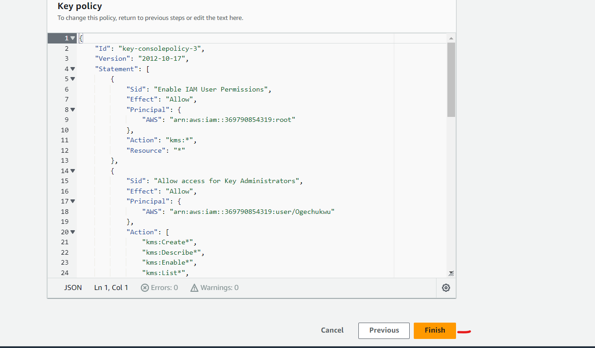


__Create a DB Subnet Group__

A DB subnet group is a collection of subnets (usually private) that you define for a Virtual Private Cloud (VPC) to designate for your database instances. Based on the project architecture, you should specify the appropriate private subnets—specifically, Private Subnet 3 and Private Subnet 4—for use with the database.


Select the availability zones us-east-1a and us-east-1b, along with the corresponding subnets for the RDS configuration based on the project design.


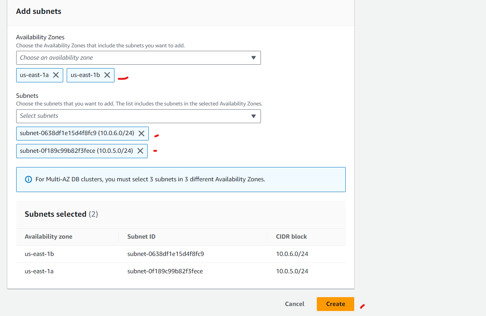


__create RDS__


Both the production and development/testing environments enable you to encrypt the database using a KMS key. For this project, we will choose the MySQL engine's free tier to minimize costs.


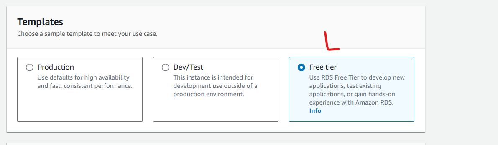


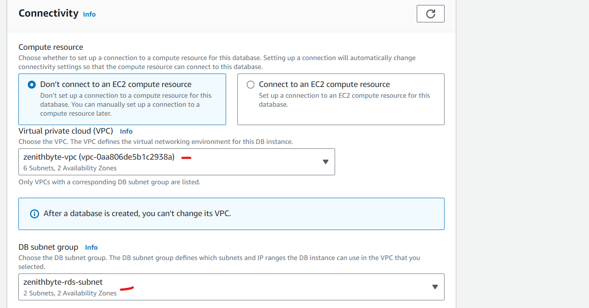


### Proceed With Compute Resources


Setting up compute resources in your VPC for Nginx involves several steps, including launching EC2 instances, creating a launch template, configuring target groups, and setting up autoscaling.


__Step 1: Provision EC2 Instance for Nginx__

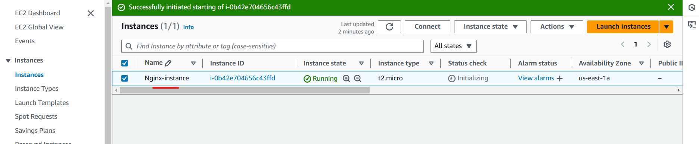


__step 2: Install Required Packages__

- Once logged into the instance, run the following commands to install the required packages and configure SELinux policies

```
# Enable EPEL repository and install dependencies

sudo yum install -y https://dl.fedoraproject.org/pub/epel/epel-release-latest-8.noarch.rpm
sudo yum install -y dnf-utils http://rpms.remirepo.net/enterprise/remi-release-8.rpm
sudo yum install wget vim python3 telnet htop git mysql net-tools chrony -y


# Start and enable NTP service

sudo systemctl start chronyd
sudo systemctl enable chronyd
sudo systemctl status chronyd

# Configure SELinux policies

sudo setsebool -P httpd_can_network_connect=1
sudo setsebool -P httpd_can_network_connect_db=1
sudo setsebool -P httpd_execmem=1
sudo setsebool -P httpd_use_nfs 1


# Install Amazon EFS client utils

git clone https://github.com/aws/efs-utils
cd efs-utils
sudo yum install -y make
sudo yum install -y rpm-build
sudo make rpm
sudo yum install -y  ./build/amazon-efs-utils*rpm

```


__step 3: Set up Self-Signed SSL Certificate__

- Configure SSL by generating a self-signed certificate for securing HTTPS connections:

```

# Create directory and set permissions for SSL

sudo mkdir /etc/ssl/private
sudo chmod 700 /etc/ssl/private


# Generate self-signed certificate and Diffie-Hellman parameter

openssl req -x509 -nodes -days 365 -newkey rsa:2048 -keyout /etc/ssl/private/zenithbyte.key -out /etc/ssl/certs/zenithbyte.crt

sudo openssl dhparam -out /etc/ssl/certs/dhparam.pem 2048


# To verify that my certificate installation was successful and that it is present on the server.

sudo ls -l /etc/ssl/certs/
sudo ls -l /etc/ssl/private/

# Start and enable nginx

sudo systemctl start nginx
sudo systemctl enable nginx

```

__step 4: Configure Nginx Reverse Proxy
Create a custom Nginx configuration file for reverse proxy setup. Save the configuration below as `/etc/nginx/reverse.conf`:__

```
user nginx;
worker_processes auto;
error_log /var/log/nginx/error.log;
pid /run/nginx.pid;

include /usr/share/nginx/modules/*.conf;

events {
    worker_connections 1024;
}

http {
    log_format  main  '$remote_addr - $remote_user [$time_local] "$request" '
                      '$status $body_bytes_sent "$http_referer" '
                      '"$http_user_agent" "$http_x_forwarded_for"';

    access_log  /var/log/nginx/access.log  main;

    sendfile            on;
    tcp_nopush          on;
    tcp_nodelay         on;
    keepalive_timeout   65;
    types_hash_max_size 2048;

    default_type        application/octet-stream;
    include /etc/nginx/conf.d/*.conf;

    server {
        listen       80;
        listen       443 http2 ssl;
        listen       [::]:443 http2 ssl;
        root         /var/www/html;
        server_name  ogechukwu.site;

        ssl_certificate /etc/ssl/certs/zenithbyte.crt;
        ssl_certificate_key /etc/ssl/private/zenithbyte.key;
        ssl_dhparam /etc/ssl/certs/dhparam.pem;

        location /healthstatus {
            access_log off;
            return 200;
        }

        location / {
            proxy_set_header Host $host;
            proxy_pass https://internal-zenithbyte-alb-500059783.us-east-1.elb.amazonaws.com/;
        }
    }
}

```

### Setup compute resources for Bastion server

__Step 1: Provision the EC2 Instance for Bastion Server__


__Step 2: Install Required Packages__


```
# Install EPEL and Remi repositories

sudo yum install -y https://dl.fedoraproject.org/pub/epel/epel-release-latest-8.noarch.rpm

sudo yum install -y dnf-utils http://rpms.remirepo.net/enterprise/remi-release-8.rpm


# Install additional utilities
sudo yum install -y wget vim python3 telnet htop git mysql net-tools chrony -y

# Start and enable chronyd
sudo systemctl start chronyd
sudo systemctl enable chronyd
sudo systemctl status chronyd

```

__step 3: Connect to RDS and Create Databases__


```
# Start SSH agent
eval `ssh-agent`

# Add your private key
ssh-add path/to/your/project-key.pem

# Connect to the Bastion host
ssh -A ec2-user@<Bastion_IP_Address>

```

__step4: Connect to the MySQL RDS Instance: From the Bastion host, connect to your RDS instance using MySQL client:__

```
mysql -h <RDS_endpoint> -u <username> -p
```
__step5: Create Databases: Once logged into MySQL, run the following commands to create the required databases:
sql__

```
CREATE DATABASE wordpressdb;
CREATE DATABASE toolingdb;
```


### Setup compute resources for webserver


__step1: Provision EC2 Instances for Web Servers__


__step2: Install Required Packages__

```
sudo yum install -y https://dl.fedoraproject.org/pub/epel/epel-release-latest-8.noarch.rpm
sudo yum install -y dnf-utils http://rpms.remirepo.net/enterprise/remi-release-8.rpm
sudo yum install -y wget vim python3 telnet htop git mysql net-tools chrony

# Configure and Start Chrony
sudo systemctl start chronyd
sudo systemctl enable chronyd
sudo systemctl status chronyd

# Configure SELinux Policies
sudo setsebool -P httpd_can_network_connect=1
sudo setsebool -P httpd_can_network_connect_db=1
sudo setsebool -P httpd_execmem=1
sudo setsebool -P httpd_use_nfs 1

# Install Amazon EFS Utils
git clone https://github.com/aws/efs-utils
cd efs-utils

# Install dependencies and build the RPM package:
sudo yum install -y make rpm-build
sudo make rpm

# Install the EFS utilities RPM:
sudo yum install -y ./build/amazon-efs-utils*rpm

# Set Up Self-Signed SSL Certificate
sudo yum install -y mod_ssl

# Generate the self-signed certificate:
sudo openssl req -x509 -nodes -days 365 -newkey rsa:2048 \
-keyout /etc/ssl/private/zenithbyte.key \
-out /etc/ssl/certs/zenithbyte.crt

# Update Apache Configuration for SSL
# Open the ssl.conf file in a text editor:
sudo vi /etc/httpd/conf.d/ssl.conf

# Replace the paths for SSLCertificateFile and SSLCertificateKeyFile:
SSLCertificateFile /etc/ssl/certs/zenithbyte.crt
SSLCertificateKeyFile /etc/ssl/private/zenithbyte.key

# Restart Apache
sudo systemctl restart httpd
sudo systemctl enable httpd
sudo systemctl status httpd

```


Creating the AMIs for Webserver, Bastion and Nginx

Select Instance > Action > Image and Templates > Create Image


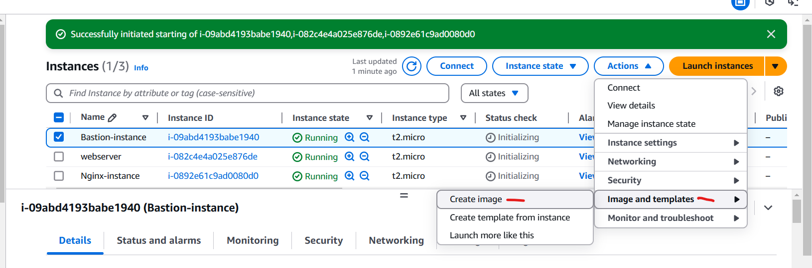


__Configuring Target Groups__

__For Nginx Server__

- Selecting Instances as the target type
- Ensuring the protocol HTTPS on secure TLS port 443
- Ensuring that the health check path is /healthstatus


```
Step 1: In the left-hand menu, under Load Balancing,click on Target Groups.

Step 2: Create a New Target Group
Click on Create target group.
Configure the following details:
Choose a target type: Select Instances.
Target group name: Enter a descriptive name, e.g., nginx-target-group.
Protocol: Select HTTPS.
Port: Set the port to 443 (the secure TLS port).
VPC: Choose the VPC where the Nginx instances are running.

Step 3: Configure Health Checks
Health check protocol: Select HTTP or HTTPS (use HTTPS for secure checks).
Health check path: Enter /healthstatus.
Optional: Configure advanced health check settings as needed:
Healthy threshold: Number of consecutive successful checks required before considering the target healthy (e.g., 3).
Unhealthy threshold: Number of consecutive failed checks required before considering the target unhealthy (e.g., 3).
Timeout: Time to wait for a response during a health check (e.g., 5 seconds).
Interval: Time between health checks (e.g., 30 seconds).

Step 4: Register Targets
In the Register targets section, select the Nginx instances you want to include in this Target Group.
Click Include as pending to add them to the list.
Click Create target group to complete the setup.
```


__For Wordpress__

- Selecting Instances as the target type
- Ensuring the protocol HTTPS on secure TLS port 443
- Ensuring that the health check path is /healthstatus

__For Tooling__

- Selecting Instances as the target type
- Ensuring the protocol HTTPS on secure TLS port 443
- Ensuring that the health check path is /healthstatus


__Configuring Application Load Balancer (ALB)__

__Create the ALB forwarding traffic to the Nginx reverse proxy__


__Create the ALB forwarding traffic to the Webservers__

There are two target groups: tooling and WordPress. We will configure WordPress as the default target group.


__We go to the listeners to set rules for the the tooling target group__


__Creating A Launch Template__

__For Bastion__


